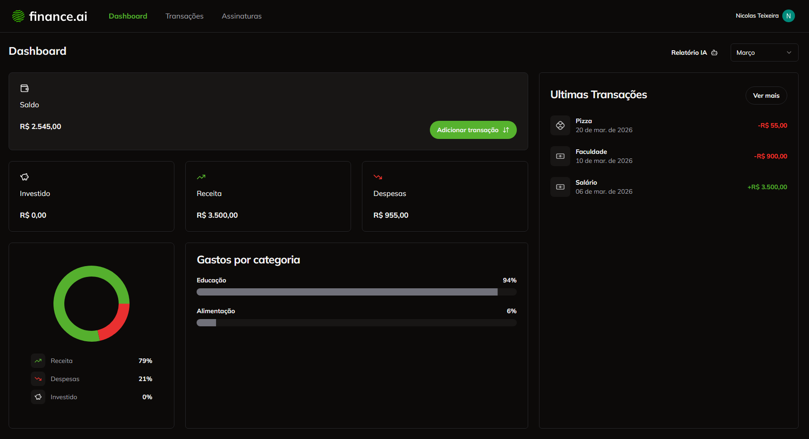
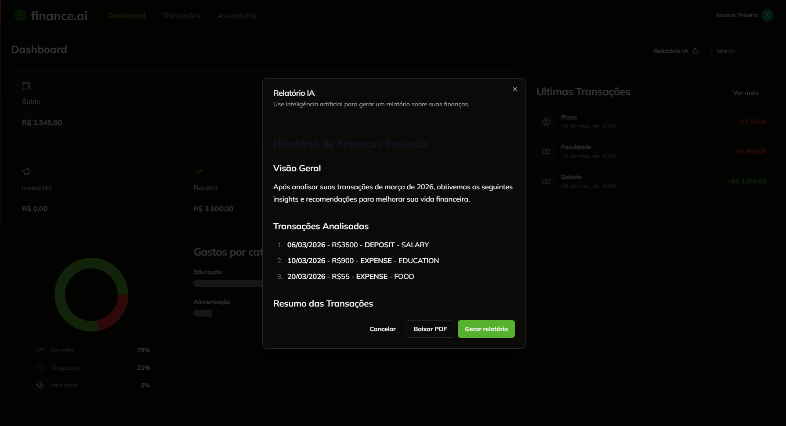

# Finance AI

Aplicação SaaS de finanças pessoais com autenticação, dashboard mensal, controle de transações, assinatura premium e geração de relatórios com inteligência artificial.

## Visão geral

O **Finance AI** é um projeto full stack voltado para organização financeira pessoal. A aplicação permite registrar receitas, despesas e investimentos, acompanhar indicadores em um dashboard interativo e, para usuários do plano Pro, gerar relatórios inteligentes com IA e exportá-los em PDF.

O objetivo do projeto foi construir uma aplicação com características reais de mercado, envolvendo autenticação, controle de acesso por assinatura, integração com pagamento, consumo de IA, persistência de dados e deploy em produção.

## Demonstração





- **Aplicação em produção:** [saas-finance-ai](https://saas-finance-ai.vercel.app)

## Funcionalidades

- Autenticação de usuários
- Dashboard financeiro com filtro por mês
- Cadastro de receitas, despesas e investimentos
- Visualização de saldo, receitas, despesas e investimentos
- Gráfico de distribuição por tipo de transação
- Gráfico de despesas por categoria
- Listagem das últimas transações
- Controle de plano gratuito e plano Pro
- Integração com Stripe para assinatura
- Geração de relatório financeiro com IA
- Exportação do relatório em PDF
- Isolamento de dados por usuário autenticado

## Tecnologias utilizadas

### Frontend

- Next.js
- React
- TypeScript
- Tailwind CSS
- shadcn/ui
- Recharts
- React Markdown

### Backend e serviços

- Next.js Server Actions
- Prisma ORM
- PostgreSQL
- Clerk
- Stripe
- OpenAI API

### Deploy

- Vercel

## Arquitetura e integrações

O projeto foi construído com **Next.js App Router**, unificando frontend e backend na mesma aplicação. A lógica de negócio e integração com serviços externos foi organizada para refletir cenários comuns de um SaaS real.

### Principais integrações

- **Clerk** para autenticação e gerenciamento de usuários
- **Stripe** para checkout e controle de assinatura Pro
- **OpenAI** para geração de relatórios financeiros inteligentes
- **Prisma** para modelagem e acesso aos dados
- **Vercel** para deploy e hospedagem

## Diferenciais do projeto

Este projeto vai além de um CRUD simples. Ele aborda cenários reais de desenvolvimento, como:

- autenticação e autorização
- controle de funcionalidades por tipo de plano
- integração com gateway de pagamento
- uso de inteligência artificial em uma feature premium
- exportação de relatórios em PDF
- proteção dos dados por usuário
- deploy em produção com ajustes específicos de build

## Desafios técnicos enfrentados

Durante o desenvolvimento, alguns pontos exigiram atenção especial:

- garantir que cada usuário visualize apenas as próprias transações
- controlar corretamente as features exclusivas do plano Pro
- integrar checkout e retorno do Stripe
- evitar mistura de dados entre usuários na geração de relatórios com IA
- gerar PDFs com boa apresentação visual
- corrigir problemas de tipagem em ambiente de produção
- ajustar a geração do Prisma Client no deploy da Vercel
- tratar percentuais e estados vazios no dashboard sem quebrar a interface

## Aprendizados

Com este projeto, aprofundei conhecimentos em:

- desenvolvimento full stack com Next.js
- autenticação moderna com Clerk
- integração de assinaturas com Stripe
- modelagem e persistência de dados com Prisma
- consumo de APIs externas
- geração de conteúdo com IA
- geração de PDF no frontend
- troubleshooting de build e deploy em produção

## Como rodar o projeto localmente

### 1. Clone o repositório

```bash
git clone [URL_DO_REPOSITORIO]
